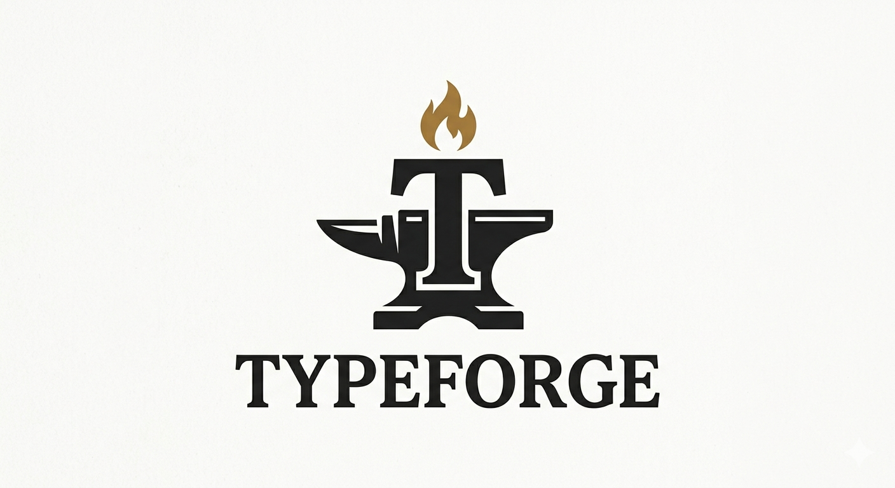

# TypeForge




A python module to help automatize report generation based on jinja2 with support for multiple databases.

## Input supported

- ArcGIS Online
- PostgreSQL / PostGIS (coming soon)
- GeoPackage (coming soon)

## Output supported

- DOCX
- PDF (coming soon)

## Requirements

- Python 3.11+
- ArcGIS API for Python
- Other dependencies listed in `requirements.txt`

## Installation

```bash
git clone https://github.com/RikFerreira/typeforge.git
pip install ./typeforge
```

## Usage

Example:

```python
from package_name.feature_layer import get_agol_feature_layer

features = get_agol_feature_layer(
    feature_layer_url="https://.../FeatureServer/0",
    filter_expression="1=1",
    fields="*",
    return_geometry=False,
    attachments_action="metadata"
)
```

Example with attachment download:

```python
from package_name.feature_layer import get_agol_feature_layer

result = get_agol_feature_layer(
    feature_layer_url="https://.../FeatureServer/0",
    filter_expression="1=1",
    attachments_action="download",
    attachments_dir="output/attachments"
)
```

## Roadmap

- [ ] Improve attachment metadata handling
- [ ] Add logging as a text file

## Contributing

1. Fork the repository.
2. Create a feature branch.
3. Commit changes with clear messages.
4. Open a pull request.

## License

MIT License